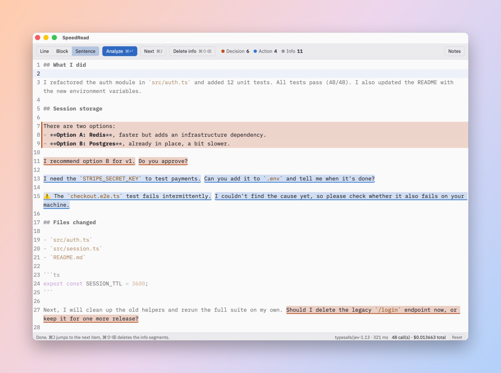

<p align="center">
  
</p>

<h1 align="center">SpeedRead</h1>

<p align="center">
  <strong>Read AI coding agent outputs in seconds.</strong><br>
  Paste what Claude Code, Codex or any other agent wrote. SpeedRead highlights what needs your decision or your action, and dims everything else.
</p>

<p align="center">
  Powered by <a href="https://typesafe.ai">Jev</a>, TypeSafe's new decision model · macOS · MIT
</p>



## Why

Coding agents write long reports. Most of it is status: what they did, which files changed, which tests pass. Buried inside are the few sentences that actually need you: a choice between two options, a key to provide, a failing test to check.

SpeedRead finds those sentences for you:

- **Decision** (orange): a choice, a proposal or an approval is waiting for you.
- **Action** (blue): something to do, a question to answer or a problem to handle.
- **Info** (dimmed): plain report. Delete all of it in one keystroke and keep only your to-do list.

## Powered by Jev

SpeedRead is built on [Jev](https://typesafe.ai), the first "System One" model from [TypeSafe](https://typesafe.ai), served through the [OpenRouter Decisions API](https://openrouter.ai/docs/guides/community/jev). Jev does not generate text. It answers typed questions with a choice and a probability for each option, which is exactly what triage needs:

- **Fast**: a whole agent message is classified in about 0.3 to 0.6 seconds, batched into a single call.
- **Cheap**: a typical analysis costs a few hundredths of a cent.
- **Calibrated**: the color intensity follows Jev's probability, so confident verdicts stand out more.

## Features

- **Three granularities**: classify each line, each Markdown block, or each sentence. Sentence mode shines on long agent paragraphs where one sentence out of six matters.
- **Delete info**: remove every info segment at once, including info sentences inside kept lines. Undo restores the text and its colors.
- **Jump to next**: move through decisions and actions with one shortcut.
- **Focused editor**: line numbers, click a number to select its line, Markdown highlighting that never hides a character.
- **Notes panel**: a second editor on the right for your own notes. Nothing typed there is sent to Jev. Notes are saved locally.
- **Call ledger**: every Jev call is logged locally with its cost, and the status bar shows the running total.

## Shortcuts

| Shortcut | Action |
|---|---|
| ⌘↵ | Analyze (runs on its own when a paste replaces the whole text) |
| ⌘L | Cycle through Line, Block and Sentence modes |
| ⌘J | Jump to the next decision or action |
| ⌘⇧⌫ | Delete every info segment |
| ⌘Z | Undo, colors included |
| Click a line number | Select the whole line |

## Getting started

SpeedRead currently targets macOS. You need [Node.js](https://nodejs.org) 24 or later, [Rust](https://rustup.rs) and the Xcode Command Line Tools, plus an [OpenRouter API key](https://openrouter.ai/keys).

```bash
mkdir -p ~/.speedread
echo "OPENROUTER_API_KEY=your-key" > ~/.speedread/.env
git clone https://github.com/TomySpagnoletti/speed-reading-app.git
cd speed-reading-app
npm install
npm run tauri dev
```

To build and install the app:

```bash
npm run tauri build -- --bundles app
cp -R src-tauri/target/release/bundle/macos/SpeedRead.app /Applications/
```

The app reads `OPENROUTER_API_KEY` from `~/.speedread/.env` on every request, so you can move or delete the cloned folder after installing. The key never reaches the web view.

## Privacy

- The text you analyze is sent to OpenRouter and TypeSafe to be classified.
- Your API key stays on your machine, in `~/.speedread/.env`.
- Notes stay on your machine, in `~/.speedread/notes.md`.
- The call ledger stays on your machine, in `~/.speedread/ledger.jsonl`. The Reset button in the status bar clears it after a confirmation click.

## How it works

1. The pasted text is split into segments: lines, Markdown blocks or sentences. Code blocks and separators are marked as info locally, without any call.
2. Each segment becomes one Jev choice question with three options. The whole numbered message is sent as context, so a list item is judged with the question that introduces it.
3. Answers are painted as they arrive. Editing a segment drops its color, since the verdict no longer matches the text.

## Development

```bash
npm test
```

This runs the TypeScript unit tests with the Node test runner and the Rust tests with Cargo.

| Path | Role |
|---|---|
| `src/segment.ts` | Splitting into lines, Markdown blocks or sentences |
| `src/jev.ts` | Jev model, category criteria, batched calls |
| `src/classes.ts` | Colors, info deletion, navigation |
| `src/editor.ts` | Editor setup shared by the main editor and the notes panel |
| `src/main.ts` | Analysis flow, toolbar, notes panel and shortcuts |
| `src-tauri/src/lib.rs` | OpenRouter proxy, API key loading, call ledger, notes storage |
| `app-icon.svg` | Icon source, turned into every platform format with `npx tauri icon app-icon.svg` |

Contributions are welcome. Read [AGENTS.md](AGENTS.md) first: the code is in English, has no comments, and every piece of logic lives in exactly one place.

## Roadmap

SpeedRead is built with Tauri, so Windows, Linux, iOS and Android builds are within reach. Only macOS is built and tested today.

## License

[MIT](LICENSE) © 2026 Tomy Spagnoletti Duval · [brainroad.xyz](https://brainroad.xyz)
